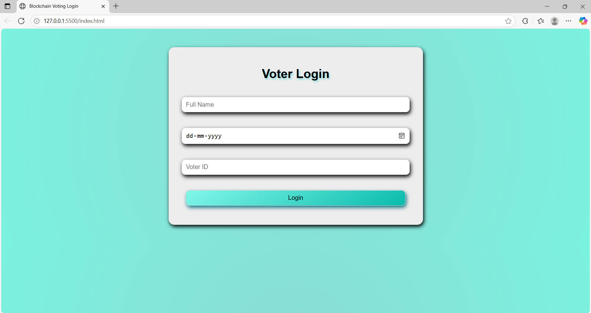
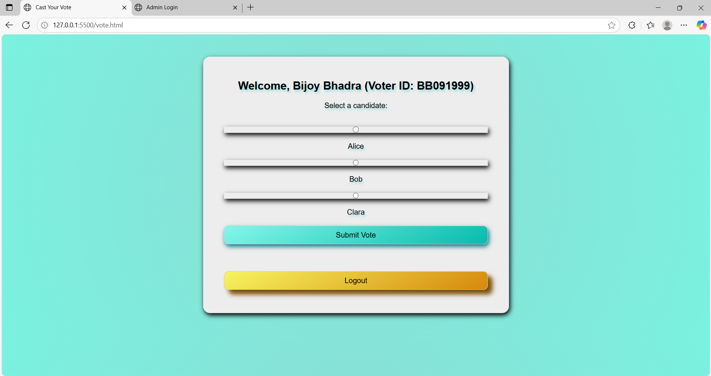
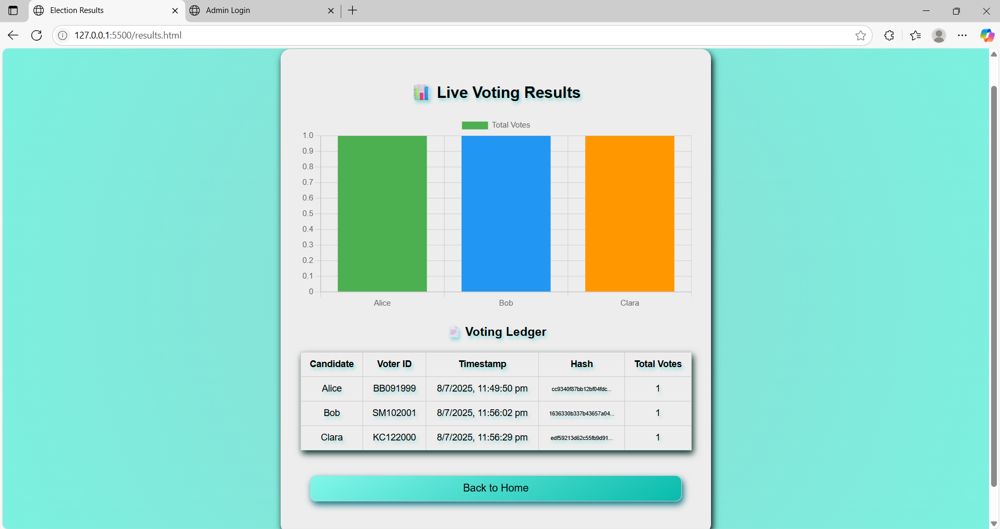
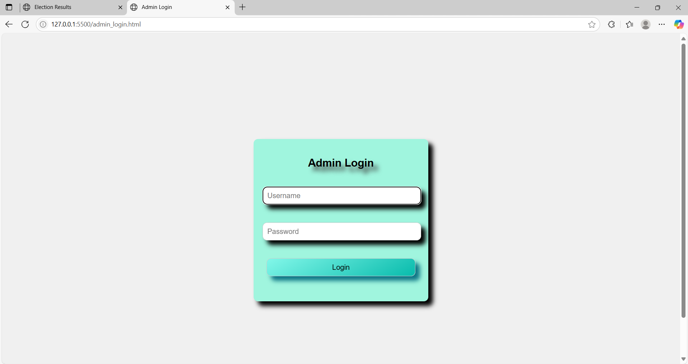

# Online-Voting-System-Using-Blockchain

A prototype web-based voting application built using **HTML**, **CSS**, and **JavaScript**. This project demonstrates a **conceptual blockchain** implementation for secure and transparent vote storage using browser-side logic.

---

## 📌 Features

- 🧑‍💼 **Admin Login Interface**
- 🗳️ **User Voting Panel**
- 🔐 **Blockchain Simulation** for vote integrity
- 📊 **Vote Tally Display**
- 🎨 Styled with custom CSS

---

## 📂 Project Files

| File                | Description                                 |
|---------------------|---------------------------------------------|
| `index.html`        | Home page with navigation                   |
| `vote.html`         | Page where users cast votes                 |
| `admin_login.html`  | Admin login form                            |
| `admin.html`        | Admin dashboard to view votes               |
| `results.html`      | Displays voting results                     |
| `blockchain.js`     | JavaScript simulating blockchain storage    |
| `style.css`         | Styling for all pages                       |

---

## ⚙️ How It Works

- Votes are added to a **JavaScript-based blockchain array**
- Blockchain data is stored locally using `localStorage`
- Admin can view submitted votes securely after login
- Results are dynamically rendered from stored data

> ⚠️ Note: This is a **prototype** and does **not use real cryptographic blockchain or web3.js**. Data is stored and simulated locally for educational purposes.

---

## 🚀 Getting Started

1. Clone the repository:
- git clone https://github.com/Bijoy781999/blockchain-voting-system.git

2. Open `index.html` in your browser.
> No backend or server setup is required – it runs fully in the browser.

---

## 🛠️ Tech Stack

- **HTML5**
- **CSS3**
- **JavaScript**
- `localStorage` for persistence

---

## 📷 Screenshots

#### 🏠 Veter Login

#### 🗳️ Voting Page

#### 📊 Results Page

#### 🔐 Admin Login

#### 🏠 🗳️ Admin Panel
.png,Images/Screenshot_AdminPanel(2).png)
